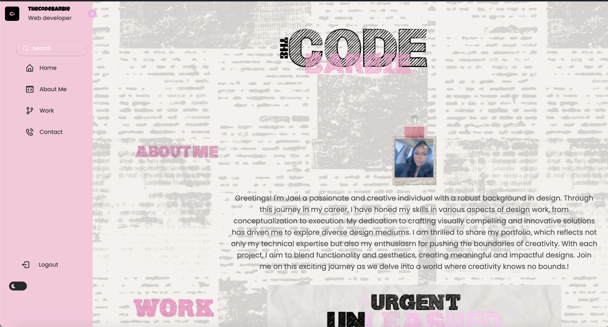
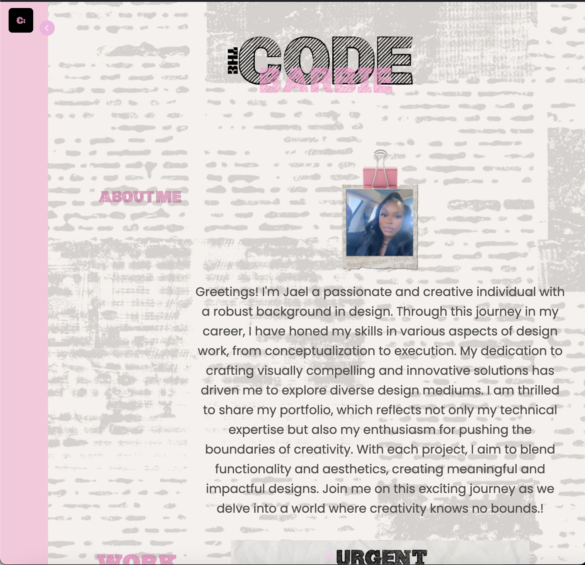
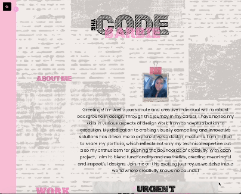

# TheCodeBarbie Portfolio 

## Description
Welcome to my portfolio! This project is a reflection of my journey as a developer, showcasing my skills, projects, and design philosophy. Crafted with the goal of making a lasting impression on potential employers, this portfolio is more than just a static display—it's a dynamic representation of my evolving abilities.

## Table of Contents

- [Description](#description)
- [Screenshots](#screenshots)
- [Deployment](#deployment)
- [Usage](#usage)
- [Credits](#credits)
- [License](#license)

# Motivation

My motivation for constructing this portfolio stems from my eagerness to showcase my skills to potential employers. Through providing insights into my coding proficiency, design mindset, and adept problem-solving abilities, my goal is to distinguish myself in a competitive field. The aim is to demonstrate a steadfast commitment to delivering solutions that are both impactful and innovative.

## Purpose

Beyond being a course assignment, this portfolio serves as a strategic tool in my job search. It's a testament to my dedication to continuous improvement and a tangible demonstration of the value I bring to a team. With a user-centric approach, the portfolio provides an intuitive and engaging experience for anyone exploring my work.

## Key Learnings

Throughout this project, I've delved into responsive design, ensuring a seamless experience across diverse devices. The navigation and user experience are carefully crafted to guide visitors through my projects effortlessly. The use of CSS selectors, including parent and child selectors, plays a crucial role in styling and structuring elements.

Flexbox is harnessed for efficient layout design, ensuring flexibility and responsiveness. Additionally, the integration of JavaScript brings dynamism to the portfolio, allowing for dynamic changes and updates to enhance interactivity.

## What problem does this solve?

This portfolio addresses the challenge employers face when evaluating a candidate's suitability. By presenting a well-organized compilation of projects, skills, and experiences, I aim to simplify the assessment process and provide a clear picture of the unique value I can bring to a team.

Thank you for exploring my portfolio—I hope it gives you valuable insights into my journey and capabilities as a developer. Feel free to reach out for further discussions or collaborations!

## Usage

## Credits

This project acknowledges the following open-source contributions:

Fonts provided by Google Fonts
Universe images sourced from universe.io
Utilized components and styles from MDBootstrap
Appreciation goes to these platforms for their open-source files, enriching the visual and functional aspects of this project.

## Deployment

The application is deployed using [Github Pages](https://thecodebarbie.github.io/TCB-Portfolio/) 

The GitHub repository for this project is available [here](https://github.com/Thecodebarbie/TCB-Portfolio).

** Be sure to deploy the site using Chrome, Brave Mozilla. Safari will not safely deploy this application. **

## Features

Experience the versatility of this website with a seamlessly integrated dark/light mode switch, strategically placed within the navigation bar. The menu bar links offer a sophisticated hover effect, providing a smooth transition for an aesthetically pleasing user interaction. Navigating through the sections is made intuitive, with the navigation links directing you precisely to your desired content.

The contact section introduces a subtle hover effect, adding a refined touch to the user experience. In the footer, engage with the interactive social links that gracefully guide you to their respective websites or webpages upon a click.

## How to Deploy Locally

If you want to deploy this portfolio locally, follow these steps:

Clone the repository to your local machine:

1. git clone https://github.com/your-username/your-repository-name.git

2. navigate to project directory; cd your-repository-name

3. open the `index.html` file in your preferred web browser. Now you should be able to view the portfolio locally on your computer. Replace `your-username` and `your-repository-name with your GitHun username and the name of your repository`

## License

This project is licensed under the MIT License. Feel free to use, modify, and distribute the code as per the terms of the license. Refer to the LICENSE file for more details.
